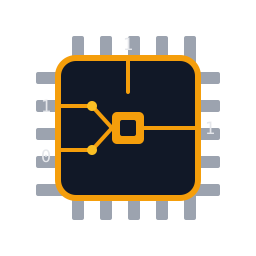

<p align="center">
  
</p>

<h1 align="center">BitByBit</h1>

<p align="center">
  <a href="LICENSE"></a>
  
  
  
</p>

**From a single transistor to working SAP-1 and SAP-2 CPUs — simulated gate by gate.**

BitByBit is an educational, bottom-up simulation of complete CPUs. It models
machines literally from their most elementary physical components: PMOS and
NMOS transistors. On top of them it builds every logic gate, multiplexer,
adder, flip-flop, and finally full computers — the SAP-1 and SAP-2
("Simple As Possible") from classic textbooks and the Ben Eater
breadboard-computer series.

> **Status:** the Rust implementation (`rust/`) is the active one: SAP-1,
> SAP-2 and a tiny assembler for both. The Python implementation
> (`python/`) is **legacy** — frozen but usable, SAP-1 only.

The project is deliberately *naive*: it never relies on the host language's
boolean operators inside the hardware layer. Everything is wired by hand from
transistors, exactly the way real digital hardware is built. Control signals
are gate nets, buses are tri-state wires resolved with short-circuit
detection — no software branching in the datapath.

---

## Layout

```
rust/                      # active implementation (Cargo)
    src/
        hardware.rs        # transistors, wire, bus, stabilization
        gates.rs           # NOT/NAND/NOR/AND/OR/XOR/XNOR from transistors
        mux.rs / decoder.rs
        arithmetic.rs      # adders, ALU-SAP1, ALU-SAP2
        latches.rs         # SR/D latches, flip-flops, sequencers
        memory.rs          # registers, counters, RAM (256 b, 64 KiB), ports
        cpu_sap1.rs        # the SAP-1 computer + control unit
        cpu_sap2.rs        # the SAP-2 computer + decoder/control matrix
        asm.rs             # tiny assemblers for both CPUs
        main.rs            # SAP-1 benchmark (assembled from text)
python/                    # legacy implementation, SAP-1 only (uv-managed)
    bitbybit/              # hardware.py, gates.py, mux.py, decoder.py,
                           # arithmetic.py, latches.py, memory.py, cpu_sap1.py
    test/                  # pytest suite
```

---

## Rust quick start

Requires [Rust](https://www.rust-lang.org/tools/install) (edition 2021, no
external dependencies).

```powershell
cd rust
cargo test                 # 160 tests, every module + end-to-end programs
cargo run --release        # SAP-1 benchmark assembled from text
```

Run a SAP-2 program:

```rust
use bitbybit::cpu_sap2::Sap2;
use bitbybit::utils::bits_to_int;

let mut cpu = Sap2::default();
cpu.load_program(&[0x30, 10, 0xF0]).unwrap(); // MVIA 10, HLT
cpu.run(100).unwrap();
println!("A = {}", bits_to_int(&cpu.out(), false)); // -> 10
```

Or write it readably with the assembler:

```rust
use bitbybit::asm::assemble_sap2;

let program = assemble_sap2("MVIB 3\nMVIA 5\nADD B\nHLT").unwrap();
cpu.load_program(&program).unwrap(); // -> A = 8
```

---

## SAP-2 instruction set

Instructions are 1–3 bytes. Jumps and memory operands take a 16-bit address,
low byte first. Flags: `Z` (zero), `C` (carry), `S` (sign, bit 7).

| Bytes | Instruction | Effect |
|---|---|---|
| `00` | `NOP` | no operation |
| `10 ll hh` | `LDA addr` | `A <- MEM[addr]` |
| `20 ll hh` | `STA addr` | `MEM[addr] <- A` |
| `30 d` | `MVIA d` | `A <- d` (immediate) |
| `40 d` | `MVIB d` | `B <- d` (immediate) |
| `50` | `ADD B` | `A <- A + B` |
| `51` | `SUB B` | `A <- A - B` |
| `52`/`53`/`54` | `ANA`/`ORA`/`XRA B` | `A <- A AND/OR/XOR B` (clear carry) |
| `55` | `CMA` | `A <- NOT A` (flags untouched) |
| `56`/`57` | `INRA`/`DCRA` | `A <- A + 1` / `A - 1` |
| `60` | `IN` | `A <- input switches` (see `set_input`) |
| `61` | `OUT` | `output display <- A` (see `output()`) |
| `70 ll hh` | `JMP addr` | `PC <- addr` |
| `80`/`90`/`A0 ll hh` | `JZ`/`JNZ`/`JM addr` | jump if `Z` / not `Z` / `S` |
| `B0 ll hh` | `CALL addr` | push `PC`, jump (see note) |
| `C0` | `RET` | `PC <- pop()` (see note) |
| `C1`/`C2` | `PSHA`/`POPA` | push `A` / `A <- pop()` (see note) |
| `F0` | `HLT` | halt |

> **Note:** `CALL`/`RET`/`PUSH`/`POP` microcode is known-imperfect (bytes
> overlap on the stack, see the `ponytail:` note on `Sap2`). Prefer
> jumps and memory for now.

The SAP-1 set (`LDA`/`ADD`/`SUB`/`STA`/`LDI`/`JMP`/`JZ`/`JC`/`HLT`, one byte
each, 4-bit operand) is documented in `rust/src/cpu_sap1.rs`.

---

## Assembler

`assemble_sap1` / `assemble_sap2` share the same rules: one instruction per
line, `;` comments, blank lines ok, case-insensitive, numbers decimal or
`0x` hex, `DB` emits raw data bytes. Errors carry line numbers. No labels
yet — jump targets are hand-counted byte offsets.

```
; SAP-2: countdown from 3, halt with A = 99
    MVIB 1
    MVIA 3
    SUB B      ; Z set when A reaches 0
    JZ 11
    JMP 4
    MVIA 99
    HLT
```

---

## Python (legacy)

Frozen SAP-1 implementation. Usable via [uv](https://github.com/astral-sh/uv),
Python 3.13+:

```powershell
cd python
uv sync
.venv\Scripts\python.exe -m pytest -q   # note: plain `uv run pytest` fails
                                        # on paths with spaces (uv trampoline)
```

```python
from bitbybit.cpu_sap1 import SAP1
from bitbybit.hardware import bits_to_int

cpu = SAP1()
cpu.load_program([0x5A, 0xF0])  # LDI 10, HLT
cpu.run()
print(bits_to_int(cpu.out))     # -> 10
```

Known quirk (legacy, will not be fixed): `test_gates.py::TestOrGate::
test_invalid_input` fails — the test expects `InvalidSignalError` where the
code raises `InvalidBitError`. Everything else (180 tests) passes.

---

## The simulation contract

1. **Two physical states only**, plus high-impedance for floating wires.
2. **The transistor is the only primitive.** Gates never use the host
   language's logic operators.
3. **Assignments are wires**, not registers.
4. **State and time.** Sequential parts update on clock edges; a simple loop
   drives discrete time forward.
5. `FAST = true` skips provably-inactive transistors only — the same nets,
   faster.

---

## License

[Apache License, Version 2.0](https://www.apache.org/licenses/LICENSE-2.0).
See [LICENSE](LICENSE).
